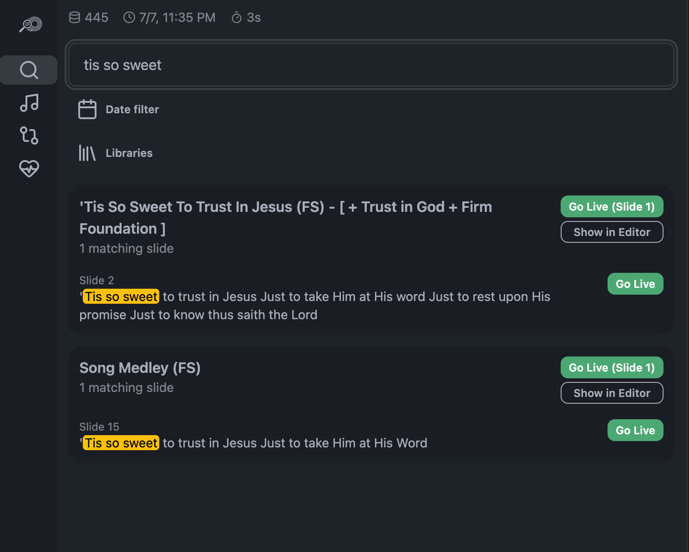

# Refrain

[](https://github.com/capitalchurchtech/refrain/actions/workflows/ci.yml)
[](LICENSE)

**The ProPresenter sidecar for the moment someone starts a song mid-service and nobody's sure which one it is.** Find any slide, in any presentation, across your entire library — not just playlist names — and jump straight to it live, in seconds, without ever leaving your seat at the booth.

Refrain runs alongside ProPresenter on your own machine — nothing to host, nothing to subscribe to, no data leaving your network unless you explicitly wire it to something.



## What it does

- 🔎 **Full-text slide search** across your whole ProPresenter library and every playlist, with one-click "Go Live" on any result — the core feature, and it works standalone with zero setup beyond ProPresenter itself.
- 📝 **Lyrics search-assist** for songs your CCLI library doesn't have — searches lyrics sites via a scoped web search, then helps you paste and auto-format lyrics into slides in seconds instead of hand-splitting them line by line.
- 🔁 **Optional: arrangement drift tracking** — compares what your church-management system planned for a song against what actually got run, and can push the correction straight back. Stop making the same manual edit every week. Fully optional, fully skippable, needs no setup if you don't want it.
- ✂️ **Optional: watched-folder image cropping** — drop a photo in a folder and get it back auto-cropped to every size you need (a 1080p slide background, a square social post, whatever you define) with smart-cropping that keeps the important part of the image in frame. Also fully optional.

## What you need

Just ProPresenter, with its local network API enabled (Preferences → Network). That's the whole requirement for the core search feature.

Everything else — a church-management integration, shared arrangement storage, image cropping — is optional and configured separately, and none of it requires ProPresenter changes or restarts. See [docs/refrain-architecture.md](docs/refrain-architecture.md) for the full picture.

## Large libraries

If your ProPresenter library has hundreds of presentations or playlists,
a full index build can be slow (and on some setups, hammering the API
with many playlists at once can make ProPresenter itself sluggish).
Scope the initial sync down in `config.json`:

```json
"librarySync": {
  "folders": ["Songs", "Messages"],
  "crawlPlaylists": false
}
```

`folders: null` syncs every Library folder. `crawlPlaylists: true` also
crawls every playlist for "which playlist is this in" metadata — the
slowest part of a rebuild, so it's off by default; search still covers
every presentation in the synced folders either way.

## Image Crop

Turn it on from the **Image Crop** screen (off by default) — no config file editing needed. The first time you enable it, Refrain creates an input and output folder for you and seeds two starting presets: 16:9 at 1080p and a 1:1 square at 900×900. Drop an image into the input folder and, within a couple seconds, you'll have one correctly-cropped file per preset waiting in the output folder — the original moves to a `processed/` subfolder rather than being deleted, so nothing is destructive.

Cropping uses [smartcrop.js](https://github.com/jwagner/smartcrop.js)'s saliency/entropy heuristic — no ML model to download, no GPU, and it holds up well across the mix of images a church actually deals with (portraits, worship graphics, text-heavy slides), not just headshots. Presets are fully your own — add, rename, or resize as many as you want, they aren't limited to the two defaults. Face-detection is on the list as a future opt-in boost for photo-heavy use cases, not a requirement to get value today.

## Installation

**Requirements:** [Node.js](https://nodejs.org) (the LTS version) and ProPresenter with its Network API enabled (Preferences → Network).

1. Get the code — either:
   - **Git** (recommended — makes updating a one-line command later): `git clone https://github.com/capitalchurchtech/refrain.git`
   - **ZIP**: on the [GitHub page](https://github.com/capitalchurchtech/refrain), click **Code → Download ZIP**, then unzip it.
2. Double-click `scripts/start.command` (Mac) or `scripts/start.bat` (Windows) — or, from a terminal: `npm install && npm start`.
3. A setup screen opens in your browser. Point it at ProPresenter's host/port, hit Test Connection, and you're in.

No terminal knowledge required for step 2 if you use the launcher script — it installs dependencies on first run automatically and doesn't require Node to already be on your PATH beyond the initial check.

## Updating

Your real settings (`config.json`) and secrets (`.env`) are never part of what git tracks or a ZIP download contains — they live only on your machine and are untouched by an update.

- **If you cloned with Git:**
  1. `git pull`
  2. `npm install` (picks up any dependency changes — safe to run even if nothing changed)
  3. Restart the app: close and re-open the launcher script, or if it's already running, stop it (`Ctrl+C` in its terminal window) and re-run `npm start`.
- **If you downloaded a ZIP:** download the latest ZIP again, unzip it to a new folder, then copy your old folder's `config.json` and `.env` into the new one before starting it — those files aren't part of any download, git or ZIP, so they only exist where you originally set them up.

Either way, a restart is required — the running server doesn't hot-reload its own code or pick up `.env` changes on its own.

## Privacy

Refrain only talks to services you explicitly configure — your own ProPresenter install, and optionally your chosen church-management API or shared storage backend. Image cropping never leaves your machine at all — no cloud API, no upload, just local processing. There's no telemetry, analytics, or phone-home to any project-controlled server.

## Compatibility

| ProPresenter version | Status |
|---|---|
| 7.x | Reference target — verify exact API paths against your version's `http://localhost:<port>/help` before relying on anything version-specific. |

## For developers

Refrain is built to be extended. Church-management integrations, storage backends, lyrics-to-slide splitting logic, and whole new feature modules are all pluggable — Image Crop is itself an example of the "whole new feature module" pattern, not a special case baked into core. See [CONTRIBUTING.md](CONTRIBUTING.md) for worked examples of adding each kind, and [docs/refrain-architecture.md](docs/refrain-architecture.md) for the full architecture.

Stack: Node.js + Express, Tailwind + DaisyUI, Lucide icons. No database anywhere in the stack — plain JSON, in-memory, or on whatever storage backend you configure (local folder by default; Firestore and SFTP backends are stubbed out and open for a contributor to finish — see [CONTRIBUTING.md](CONTRIBUTING.md)).

## Disclaimer

Refrain is an independent, community-built tool. It is not affiliated with, endorsed by, or supported by Renewed Vision (ProPresenter) or Planning Center.

## License

MIT — see [LICENSE](LICENSE).
