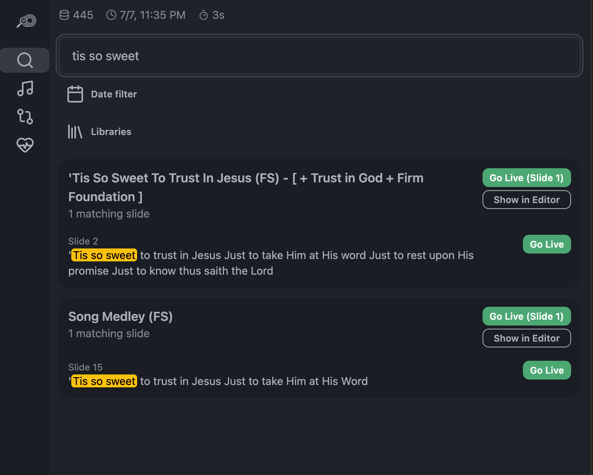

# Refrain

[](https://github.com/capitalchurchtech/refrain/actions/workflows/ci.yml)
[](LICENSE)

Find the slide. Send it. Sit back down.

Refrain is a small web app you run on the same machine as ProPresenter. It searches the words inside your slides, not just playlist and file names, and puts what you find on screen with one click. Around that it collects the other small tools a church production team ends up needing, and it's built so your team can add the next one without rewriting anything.

It runs entirely on your own machine. Nothing is hosted for you, there is no subscription, and no data leaves your network unless you connect something to it yourself.



## If you're about to build your own, read this first

Every so often a church tech lead sits down to build "a little ProPresenter tool", or hands the idea to a volunteer, or asks a chatbot to do it. The feature you actually want is usually the easy part. The slow part is everything underneath it: working out ProPresenter's local API, deciding how an outside integration should plug in, and building a setup screen a non technical volunteer can use, and getting the unglamorous things right (keeping secrets out of version control, writing files without losing data, coping with two machines running at once).

Refrain already did that groundwork, and it did it as a plugin system rather than one big tangle you'd have to unpick. If what you want is one more capability (a different church management integration, a new report, a screen only your team needs), the fast path is usually to fork this and add a module. You don't start from a blank file and rediscover all of the above. The developer section near the bottom has the details.

## What it does

**Slide search.** Type any word and Refrain finds every slide that contains it, anywhere in your library and across playlists, then lets you send it live or open it in the editor with one click. This is the core feature and it works on its own with nothing more than ProPresenter.

**Lyrics helper.** For a song your library doesn't have yet, Refrain runs a scoped web search across lyrics sites (or copies the search link so you can run it in a full browser window). It builds the link and hands you off: it never fetches or reads lyrics pages itself, which keeps it clear of those sites' terms and means there's nothing to keep licensed or updated. From there it helps you paste the words in, clean up the junk that comes with a web copy (hidden characters, odd spacing, curly quotes), and split them into slides in one step instead of breaking them up by hand. It can also spot blocks that repeat word for word (a chorus written out every time) and collapse them into one slide each, with the play order laid out so you can build the arrangement.

**Arrangement tracking (optional).** Compares the arrangement your church management system planned for a song against what actually got run in ProPresenter, and can push the correction back so you stop making the same edit every week. Skip it and nothing else changes.

**Image cropping.** Drop a photo in a folder and get it back cropped to every size you need at once (a slide background, a YouTube thumbnail, a square social post), with smart cropping that keeps the important part of the picture in frame.

**QR codes.** Generate a scannable code for a link, a WiFi network, a contact card and more, all on your own machine, with no third party generator that could expire your printed code or start charging later.

**Spell check.** Pick a playlist and Refrain scans its slides for likely typos before they go up on the screen. Words it flags that are correct for your church go on an **Ignored words** list you can see and edit, so a mis-click never hides a real typo for good. It leans on the words already common across your own library, so worship vocabulary and names it has seen before don't get flagged. Refrain can't edit slides itself, so it flags each word and jumps you to the slide in ProPresenter to fix it.

**A real plugin system under all of it.** Church management integrations, storage backends, lyrics splitting rules, and whole new screens are all things you add as files in a folder, not core surgery. When your team hits something Refrain doesn't do yet, the answer is "add a module", not "wait for a rewrite".

## What's finished and what isn't

Being straight about this, since "plugin system" can promise more than it delivers.

Working today:

- Slide search, Go Live, Show in Editor, and the date and library filters.
- The Return bar, to reopen the presentation that was live before an app jump.
- The Live page: a message poster for urgent codes, big Clear buttons, and one button per Look and Macro.
- The lyrics helper and paste to slides.
- Scripture lookup, opening a reference in Bible Gateway or Blue Letter Bible.
- Arrangement tracking end to end, with the Manual provider (you type the arrangement in) and the Planning Center provider (pulled automatically, including the one button "compare this weekend" workflow and pushing a fix back).
- Arrangement storage on a Local Folder (single machine) or a Synced Folder (a Google Drive, Dropbox, or OneDrive folder your desktop app already keeps in sync, which is how two machines share without any server).
- Image cropping, end to end.
- QR codes, end to end.
- Spell check across a playlist's slides, end to end.
- Library Sync (optional, off by default): copies one library between two machines or accounts, add-and-update only, with snapshots.
- ProPresenter first aid on the Health screen: when it won't start, Diagnose explains why and hands you a command plus a ready-made prompt.
- A readout on Search showing what is on the screens, with an elapsed clock, and a link indicator in the rail that is present on every screen.
- Reindexing only the presentations whose file changed, automatically a few seconds after you save one.
- Performance mode, which stops Refrain doing anything of its own accord while something is on the screens.
- A segmented meter for index progress, in first-run setup and on the Health screen.

Wired up but not finished (the interface exists, the methods currently refuse to run):

- The Firestore and SFTP storage backends. They show up in the config and the plugin system recognizes them, but their read and write methods are stubs. If you need true multi machine sharing and a synced folder won't do, finishing one of these is the next job, not a switch you can flip today. CONTRIBUTING.md describes the interface.
- Only two church management providers exist so far (Manual and Planning Center). Rock RMS, Church Community Builder, Elvanto and the rest are documented as places to plug in, not built integrations.

### A warning about Library Sync, and what changed

**If you ran Library Sync before v0.13.0, run it only with ProPresenter closed, and check your workspaces.**

Library Sync copies presentation files into the library folder ProPresenter reports as its own. Until v0.13.0 there was no check on whether ProPresenter was running at the time. ProPresenter keeps a private catalog of each workspace, built from the library at startup and held open while the app runs — files appearing or being replaced underneath it is how that catalog and the files on disk stop agreeing, which is what a corrupted workspace is.

One church lost three workspaces in the months after adopting Refrain, having lost none in the years before, with a sync run the night before the last one. That is correlation rather than proof, but the mechanism was real and unguarded, and it is the most likely explanation.

Refrain now refuses to run a sync while ProPresenter is running — in either direction, because reading the library while ProPresenter writes to it captures a torn file that then propagates to every other machine. If it cannot tell whether ProPresenter is running, it refuses.

Two related changes came with it. Sync no longer back-dates the timestamps of files it writes, so a file that lands in a library says when it arrived. And Refrain no longer opens presentation files at all: the index fingerprints them from `stat()` metadata, where it used to read all of them in full on every reindex.

Not independently checked:

- **Light theme is secondary.** Refrain is designed for a dark booth and starts in dark; light and system are there if you want them, and light gets the same colours, contrast, hit areas and indicators, but not the machined material — no cap gradients, lit collars or panel junctions, because a warm-graphite object does not really have a light mode. It is also the theme we look at least, and a run of defects that only appeared there (a primary action below AA contrast, a touch target under 44px, a status lamp that was invisible, a progress meter that did not render) were all found and fixed late. Those are fixed, but if you run light theme and something looks wrong, it is more likely to be real than a misreading, and worth reporting.
- Only tested against ProPresenter 7.x on the machines that built it. Other versions may need small path adjustments. See Compatibility below.
- The live-output features (Return bar, the Live page's Looks, Macros, and message poster) were built to ProPresenter's documented API but confirmed only against fake servers during development. If you run a live rig, [docs/propresenter-verification.md](docs/propresenter-verification.md) is a twenty-minute checklist to confirm them, with the exact response to capture if any endpoint differs on your version.
- Confirmed against a real ProPresenter: the library crawl, incremental reindexing (445 presentations carried over, 0 re-read, 68ms), the layer-status heartbeat, performance mode both arming itself from real screen output and holding a manual arm, the Return history across multiple jumps, and the arrangement correction — a deliberately stale slide index was re-pointed 39 slides and put the right slide on the screens. Sections 2b to 2d of [the verification checklist](docs/propresenter-verification.md) record the measurements.
- Still not seen working on a live rig: the watcher picking up a presentation you have just saved (ProPresenter's API can't edit a slide, so this needs a person), performance mode standing down on its own after twenty minutes, and its behaviour when ProPresenter quits outright. The checklist says which is which.

## What you need

ProPresenter, with its local network API turned on (Preferences, then Network). That's the whole requirement for search.

Everything else (a church management integration, shared storage, image cropping, QR codes) is optional and set up separately, and none of it asks you to change or restart ProPresenter.

## Large libraries

**Never rebuild the index near a service.** A rebuild reads every presentation in your library one at a time, and on a real library that means anything from several minutes to well over an hour. For the whole time it runs, ProPresenter itself gets sluggish and can stop answering at all, which means Go Live, Clear, and macros may not respond. Measured on a real setup: sermon-length presentations took ten to fifteen seconds each to read, and ProPresenter stopped reacting to slide triggers entirely while it was being crawled. Only start a rebuild when you are sure nothing crucial is happening for the next hour or two, and then let it finish rather than killing it partway.

**Performance mode.** While it is on, Refrain does nothing of its own accord: no indexing, no reindexing, no update checks. It keeps one small heartbeat running, every few seconds, so the link indicator and the live readout stay honest. Knowing whether ProPresenter is still answering matters more during a service, not less. Everything you press still works You are in charge; it just stops acting on its own. There is a switch on the Live screen, and it also turns itself on once something has been on the screens for a couple of minutes, and off again about twenty minutes after they go clear. Turning it on by hand keeps it on until you turn it off by hand; a timer should not overrule a person who knows a service starts in ten minutes.

It replaces an older rule that simply refused to index on Saturdays and Sundays. That was a guess at "a service is happening" and it was wrong in both directions. It blocked indexing on an empty Saturday afternoon and allowed it during a Wednesday evening service. ProPresenter reports what is actually on the screens, so Refrain asks instead of guessing. If ProPresenter cannot be reached, performance mode stays on, because not knowing is not a good enough reason to start crawling.

**Most of the time you should not have to touch the index at all.** Refrain watches your library folders, and a few seconds after you save an edited presentation it reindexes that one presentation on its own. A burst of saves collapses into a single reindex, and a slow background check every half hour covers anything the watch missed.

It is deliberately cautious about what it will do unasked:

- **It never starts a full rebuild.** If something changes that needs one, such as editing your preferred arrangements or upgrading Refrain, it stops and says so on the Health screen rather than beginning a job that makes ProPresenter sluggish for half an hour.
- **It stops at 25 changed presentations.** A bulk import or a Library Sync run shows up as "38 presentations have changed" on the Health screen, waiting for you, instead of quietly starting a multi-minute crawl.
- **It waits a few minutes after ProPresenter starts**, because reads fail en masse while ProPresenter is still indexing its own media.
- **It stays out of the way when playlist crawling is on**, since that makes every reindex expensive.

Set `"autoReindex": false` in `config.json` to turn it off and go back to reindexing by hand.

**Consider a full rebuild once a quarter.** Reindexing keeps up with anything that changes a presentation file, which is nearly everything. It does not catch playlist membership, which lives elsewhere, and not a presentation that failed to read and kept its previous slides. Refrain mentions it on the Health screen once the whole library has not been read in 90 days. It never starts one for you.

**Let ProPresenter settle before you rebuild.** Measured on a real library: a full rebuild started right after launching ProPresenter lost 221 of 445 presentations to failed reads, 219 of them in the folder crawled first, because ProPresenter is still busy indexing its own media at that point and stops answering. The same presentations then fetched in 15-30ms once it had settled. Nothing was lost (failed reads keep whatever the previous index had, and a later reindex retries them), but it turned a 15-minute job into 27 minutes plus a second pass. Give ProPresenter a few minutes after launch before starting a rebuild.

**Reindex changed only, not Rebuild Everything.** The Health screen's main button re-reads just the presentations whose file changed since the last build, which on a normal week is a handful rather than hundreds. It works out what changed by fingerprinting every presentation file on disk (size, modified time, and a content hash); measured on a real library that is 818 files and 70MB in under half a second, against fifteen minutes for a full crawl of 445 presentations. Everything unchanged keeps the slides the previous build already read.

Two things still force a full rebuild, and Refrain switches to one on its own when they happen: changing your preferred arrangements (which changes which arrangement's slide order gets indexed, for every song that has more than one) and turning playlist crawling on or off. It also falls back to a full rebuild if ProPresenter is on another machine, since there are no files to check.

Refrain deliberately does not read ProPresenter's own catalog of your workspace. That catalog lives in a hidden folder as a database held open and locked by ProPresenter while it runs, in a private format with no published structure, and a corrupted one stops ProPresenter launching at all. The presentation files hold the same information, are not locked, and Refrain only ever reads them.

You need a *full* rebuild only after changing your preferred arrangements, or when slides you have edited are not turning up in search even after a reindex. Day to day, you do not need to touch either one.

**One index build starts on its own, so know about it.** If the index is more than a day old (or was built by an older version of Refrain) when you start the app, it reindexes changed presentations in the background without asking. That is usually quick, but it becomes a full rebuild if the index was built by an older version of Refrain. Either way it is skipped entirely on a Saturday or Sunday unless you ask for it. If you are starting Refrain shortly before a service, open the Health screen first: if it says a rebuild is running, quit Refrain, and start it again once the service is over. The index you already have keeps working in the meantime.

If your library runs to hundreds of presentations or playlists, a full index build can take a while, and on some setups hitting the API with lots of playlists at once can make ProPresenter itself sluggish. You can narrow what gets indexed in `config.json`:

```json
"librarySync": {
  "folders": ["Songs", "Messages"],
  "crawlPlaylists": false
}
```

Set `folders` to `null` to index every library folder. Set `crawlPlaylists` to `true` to also record which playlist each presentation belongs to, which is the slowest part of a build, so it's off by default. Search still covers every presentation in the chosen folders either way.

### Snapping back after a tangent

Live services wander. A singer goes to a song that wasn't in the plan, you search it up and hit Go Live, and now you need to get back to exactly where the plan was, fast. The moment you use the app to jump somewhere, Refrain quietly remembers the slide that was live right before, and a **Return** bar appears across the top of every screen: one click brings that presentation back up in ProPresenter's editor so you can pick the next slide yourself.

Return opens the presentation, it doesn't fire a slide live, so it never changes what's on the screens out from under you mid-song. It only remembers the slide from that one app jump, captured at the click, and tells you which slide you were on. If you then advance seven slides by hand in ProPresenter during the tangent, Return still takes you back to where you were before the jump, not seven slides into the detour. Once you've returned, the bar clears until the next time you jump from the app. Nothing to set up, and it works with search alone.

### Seeing what a pastor changed

A common headache: someone says "I made an update" to a sermon-notes presentation that runs many pages, and you need to find what actually changed. Search gets you to a slide by its text, but it doesn't compare two versions of a document. For that, a diff tool is the right companion. Put the old and new text side by side and it highlights exactly what moved, got added, or got cut.

Keep sermon content on your own machine and use a tool that runs locally rather than a website you paste into (that would send the text off your network, which is the thing this whole project avoids):

- **VS Code** (free, Mac/Windows/Linux): open both files, right click one and pick "Select for Compare", then right click the other and pick "Compare with Selected".
- **Meld** (free, open source) or **WinMerge** (free, Windows only): purpose-built visual diff tools.
- **Beyond Compare** or **Kaleidoscope** (paid): polished options a lot of people like.
- Already in your tools: **Word** has Review, then Compare for two `.docx` files, and macOS ships `diff` in Terminal and FileMerge with Xcode's command line tools.

If the notes live somewhere with version history already (Google Docs, a Word file on OneDrive, anything under Git), its built-in "see version history" or "compare" is usually the fastest path of all.

## Scripture lookup

Open the **Scripture** screen, type a reference ("John 3:16", "Romans 8", "Psalm 23:1-6"), pick a version, and open it in **Bible Gateway** or **Blue Letter Bible** in a new tab (or copy the link to open in a full browser). It's the same idea as the lyrics helper: Refrain builds the link and hands you off, it never fetches or stores scripture text, so there's no bundled bible to keep updated and no version-licensing problem.

Bible Gateway carries nearly every translation, so that's the one for reading and copying a passage. Blue Letter Bible is the one for original-language study (interlinear, Strong's numbers, Hebrew and Greek word tools). Because Blue Letter Bible doesn't carry some modern versions (NIV, NLT, The Message), when you've picked one of those the Blue Letter link opens your configured fallback translation instead, and the screen tells you so. Set the defaults with `scriptureModule.biblegatewayVersion` and `scriptureModule.blueletterTranslation` in `config.json`.

Once you've copied the passage from the site, the same page has a **Paste and split into slides** step, the same one the lyrics helper uses: paste the text, clean up the junk that rides along from a web copy, and split it into slide-sized blocks to drop into ProPresenter. Refrain still never fetches scripture itself, so any version is fine since you did the copying by hand.

## Live page

Open the **Live** screen for a set of big, high-contrast buttons meant to be hit at a glance from the back of a dark room. The **Clear** row gets things off the screen fast: Clear All, or just the slide, media, or messages layer on their own. These always work, since they're standard ProPresenter layers.

At the top is a **message poster** for the thing that always comes up urgently mid-service: a code that needs to go on the screen right now, like "Parent of child 1234, please come to childcare downstairs." You set up a message once in ProPresenter (a message with a text token), and from then on Refrain gives you a plain text box and a big **Post to screen** button, so posting a code is type-and-hit-post instead of digging through ProPresenter's message setup every time. **Clear** takes it back down. If you have more than one such message a small picker chooses between them; messages with no text field to fill (a timer, say) aren't listed here.

Below that, Refrain lists the **Looks** and **Macros** you've set up in ProPresenter, one button each, pulled live. So your own "Logo", "Black", "Motion", or whatever you've named them show up by name with nothing to configure here, and tapping one switches the screens to it. If ProPresenter is unreachable the Clear buttons still work; the message poster, Looks, and Macros just won't be listed until it's back.

Nothing here fires a slide live on its own, so it's safe to keep open during a service. It works with search alone, no setup.

## Image cropping

Turn it on from the **Image Crop** screen. There's nothing to edit in a config file. Refrain creates a default input and output folder inside its own folder up front (and pre-fills them on the screen), so you can hit **Open**, make an alias of the input folder wherever's handy, and drop pictures straight in. You can still point it at any other folders instead. Drop a picture in the input folder and a few seconds later you'll have one cropped copy per preset in the output folder. The original isn't deleted: it moves into a `processed` subfolder inside the **output** folder, so your input folder stays empty like a proper drop box and everything you'd look at (the crops and the untouched original) is in one place.

You can point the input and output at any folders you like on that screen. On a multi-user machine this follows the same logic as where you installed Refrain: if you installed it in the shared `/Users/Shared/Refrain`, the folders it makes for you are already under there, so every account can reach them. If it's in one account's `~/Refrain`, the folders live there too, which is fine when that account does the cropping. Only if you want other accounts to drop images and collect results should you move the folders to a shared spot (a `/Users/Shared` subfolder), and make sure the account running Refrain can read and write them, since that's the account whose watcher does the work.

It starts with a set of presets aimed at what a service drops straight onto a screen: a 1080p slide background and the lower-third and book graphic sizes.

| Preset | Size | Preset | Size |
|---|---|---|---|
| 1080p (16:9) | 1920x1080 | Thirds tall | 605x808 |
| Thirds square | 693x693 | Book graphic | 515x787 |
| Thirds wide | 777x502 | | |

An **Add common size** picker holds the rest (4K, 1440p, YouTube thumbnail, OG/Facebook, the Instagram shapes, X/Twitter, LinkedIn, Pinterest, Facebook cover, ultrawide) so you never have to look up pixel dimensions, and **Add custom** covers anything else. Delete the ones you don't want. Every preset in the list becomes one output file per picture you drop.

Output files keep the original name plus the preset's label, so `promo.jpg` comes back as `promo_thirds-sq.jpg`, `promo_book.jpg`, and so on. The label is the last box on each preset row and you can edit it to anything (it's cleaned up to be filename safe on save); leave it blank and it's derived from the preset name.

Cropping uses [smartcrop.js](https://github.com/jwagner/smartcrop.js), which picks the most visually important region rather than blindly centering. There's no model to download and no GPU involved, and it holds up across the mix of images a church actually has: portraits, worship graphics, text heavy slides. Face detection is a possible future add for photo heavy work, not something you need to get value now.

### Make it a one drag habit

The idea is that you never open this screen day to day. You drag pictures onto a shortcut and collect the results. After you enable it, click **Open** next to the input folder, then make a shortcut to that folder:

- **macOS:** drag the input folder into the Finder sidebar under Favorites for a permanent drop target, or right click it, choose Make Alias, and move the alias to your Desktop.
- **Windows:** drag the input folder into Quick access in File Explorer, or right click it and choose Send to, then Desktop (create shortcut).

Leave Refrain running (minimized is fine). Drop pictures on the shortcut and the cropped versions show up in the output folder on their own. No clicking, no waiting on a screen. When the watcher is running you'll see a small green dot on the Image Crop icon in the sidebar, so you can tell it's live at a glance.

## QR codes

Open the **QR Codes** screen (it's always there, nothing to set up), pick a type, and a scannable code renders as you type. Download it as a PNG (with an optional logo in the middle) or an SVG, which is the better choice for print because it scales to any size with no blur.

Types covered: website link, plain text, WiFi network (scanning it joins the network, which is handy for a guest WiFi sign), contact card (vCard), email, phone, and SMS. You can set the size, colors, quiet zone, and error correction level (defaults to a light quiet zone and low error correction, since that reads cleanly on a screen and there's no print damage to guard against). Adding a logo bumps error correction up automatically so the code still scans.

If your church always points codes at the same site and logo, set `qrCodeModule.defaultBaseUrl` and `qrCodeModule.defaultLogoUrl` on the Health screen's Configuration form (or directly in `config.json`) so the URL field and the center logo are pre-filled every time instead of retyping and re-uploading them. Either is still replaceable or clearable per code. The logo value can be a local path Refrain already serves (e.g. `img/mylogo.png`) or a full URL.

You can also set a **default QR size** (`qrCodeModule.defaultSize`, on the same form) to the pixel size your screen layout expects. The screen then starts at that size, so a code you make drops onto the screen at the right size with no resizing. It's still adjustable per code.

Every code you download is saved to a **Recent codes** strip at the bottom of the screen. Click any one to bring back its type, content, and appearance so you can re-download it or tweak it, no retyping. A large uploaded logo isn't kept (it would bloat the history), so restoring one of those brings back everything except the logo, which you re-add. Clear the whole strip any time with the Clear button. How many to keep is up to you: set `qrCodeModule.recentLimit` on the Health screen's Configuration form (or in `config.json`), from 0 (turn the strip off) up to 100, defaulting to 20.

It all happens on your machine, and that's the point rather than a technical footnote. A lot of "free" online QR generators encode a link back through their own domain instead of your actual content, which leaves them able to expire the code, throttle it, add tracking, or start charging later. That can quietly break a code you already printed on 500 bulletins. A code made here holds your content directly, with nobody in the middle.

## Spell check

Open the **Spell Check** screen (always there, nothing to set up), pick a playlist, and Refrain reads every slide in it and flags words that look like typos. It's a picker rather than "whatever's live right now" on purpose: jumping to a slide during a service could pull you off the item you're actually running, so you choose when to look.

The trick to keeping it useful is that it doesn't just check against a plain English dictionary, which would light up half your worship lyrics. A word is only flagged if the dictionary doesn't know it **and** it's rare across your own library. So the names, places, and worship words your church uses all the time (the ones that show up on slides week after week) are treated as correct, and what's left is mostly real mistakes. Each flag comes with a suggested fix.

Refrain can't edit slides through ProPresenter's API, so it flags the word and gives you two buttons: **Show in Editor** opens the presentation in ProPresenter so you can fix it, and **Go Live** puts that slide up. If a flag is a word you use on purpose that just isn't common yet, hit **Ignore** and it goes on an allowlist (`spellcheckModule.allowlist` in `config.json`) so it's never flagged again.

## Getting around

The sidebar groups screens by when you use them: the in-service tools (Search, Live, Scripture, Lyrics, Spell Check) first, the prep tools (Arrangement, Image Crop, QR Codes) next, then Health, with a divider between each group. It starts expanded with labels the first time so nothing is a mystery icon; collapse it to a thin icon rail with the button at the bottom once you know your way around, and that choice is remembered.

The first time you open Refrain (and every start after, until you tick "Don't show this on start") a short **Welcome** card reminds volunteers of the three things they'll actually use: Search, Go Live / Show in Editor, and Return. Setup and the other tools are for the tech admin. You can bring it back any time from **Shortcuts** at the bottom of the sidebar.

Press **/** or **Cmd/Ctrl+K** from any screen to jump straight to Search with the cursor in the box. Each sidebar screen also has a number: press **1** through **9** to jump to it, and hold **Cmd/Ctrl** to see the numbers appear next to the labels. Press **?** any time (or click **Shortcuts** at the bottom of the sidebar) for the full list.

## Sharing one library between two macOS accounts

Refrain has an optional **Library Sync** screen for this, off by default and hidden unless you switch it on. If ProPresenter runs under two macOS accounts (or on two machines) and you want just the Songs library kept in step, [docs/cross-account-library-sync.md](docs/cross-account-library-sync.md) has a tested recipe: what a library looks like on disk, why a symlink does not work, and copy-only sync scripts with dated snapshots and a guard that refuses to run against an empty source. It never deletes anything, on the grounds that a song library is years of work.

## Appearance

The icon near the bottom of the sidebar cycles the theme: System, Light, Dark, and Blackroom. Dark uses high-contrast text so it stays readable on a plain (non-retina) booth monitor. Blackroom is a true-black, high-contrast option that's easy on the eyes in a dark room and looks good on an OLED screen. Your choice is remembered.

## Installing

You need Node.js and ProPresenter with its network API on (Preferences, then Network).

### Installing Node.js

Get it from [nodejs.org](https://nodejs.org) and pick the **LTS** build, the one the site labels "Recommended for Most Users". LTS stands for long term support, which is the stable line. Don't grab the "Current" build, since that's the bleeding edge and you don't need it.

On a Mac the simplest route is the `.pkg` installer from that page: double click it and click through, no terminal involved. (If the machine already uses Homebrew, `brew install node` works too, but the installer is easier for a shared booth machine.) On Windows, use the `.msi` installer from the same page.

Any LTS release from Node 18 onward works. If you're installing fresh, just take the newest LTS. You can confirm it worked by opening Terminal and running `node -v`.

### Where to put Refrain

Put the folder somewhere stable that belongs to the same user account that runs ProPresenter, so the login item in the next section can start it. A plain folder in your home directory is the easy answer:

- **macOS:** `~/Refrain` (that is, `/Users/<your-account>/Refrain`).
- **Windows:** `C:\Refrain` or a `Refrain` folder inside your user folder.

Two things to avoid. Don't put it on the Desktop or in Downloads, where it's easy to drag by accident or get swept up in a cleanup. And don't put it inside a synced folder like iCloud Drive, Dropbox, OneDrive, or Google Drive. Refrain writes a lot of small files (the search index and the installed dependencies), and syncing all of that is wasteful and can cause file lock errors. On a Mac, note that if you have iCloud's "Desktop and Documents" syncing turned on, then `~/Documents` counts as synced too, which is another reason the plain `~/Refrain` location is the safe pick.

**On a machine with several user accounts:** Refrain saves its settings, index, and dependencies inside its own folder, so the folder has to be writable by whoever runs it and reachable by the account that runs ProPresenter. If only one account operates the booth, the `~/Refrain` above is still the simplest choice. If several accounts run ProPresenter on the same machine and all want Refrain, install it once in a shared spot instead: on macOS that's `/Users/Shared/Refrain`, which every account can read and write. One shared install means one set of settings, which is what you want anyway since it's one machine and one ProPresenter. Each account that should start it on login adds its own Login Item pointing at `/Users/Shared/Refrain/scripts/start.command`. Only one copy should run at a time (it uses a local port), which is normally fine since one account is active at the booth at once. Skip `/Applications` here: it needs admin rights to write to, and Refrain needs to write into its own folder.

### Getting the code and starting it

1. Get the code into that folder, either way works:
   - **Git** (recommended, since updating is then one command): `git clone https://github.com/capitalchurchtech/refrain.git`
   - **ZIP:** on the [GitHub page](https://github.com/capitalchurchtech/refrain), click Code, then Download ZIP, and unzip it into the folder you chose.
2. Double click `scripts/start.command` on a Mac or `scripts/start.bat` on Windows. From a terminal it's `npm install && npm start`.
3. A setup screen opens in your browser. Click **Detect ProPresenter** to find it on the network and fill in the host and port automatically (make sure ProPresenter's Network API is on first, under Preferences then Network). You can still type the host and port by hand and hit Test Connection instead. Then you're in.

If you use the launcher script you don't need to touch a terminal. It installs dependencies on the first run for you.

**Do you need Git?** Only if you choose the Git option above. The ZIP download needs no Git, and nothing else does either: the launcher only runs Node, and the dependencies all come from the npm registry. The upside of Git is that updates become a single `git pull` instead of re-downloading and copying files by hand, which is worth it on a machine you'll update now and then. To install it: on macOS, type `git --version` in Terminal and, if it's missing, accept the Command Line Tools prompt that appears (you don't need full Xcode), or run `xcode-select --install` to trigger it directly. On Windows, use the installer from [git-scm.com](https://git-scm.com/download/win) with its defaults.

### Starting it automatically on reboot

There are two different things here, and they need different setups.

For an easy way to start Refrain by hand, make an alias of the launcher: right click `scripts/start.command`, choose Make Alias, and drop the alias on the Desktop, in the Dock (the right side, near the Trash), or in the Finder sidebar. That's a one click manual start. It does nothing on its own after a reboot, though, since nobody is there to click it.

For it to come back on its own after a reboot, add a Login Item. On macOS: System Settings, then General, then Login Items, then add `scripts/start.command` (or the shared path, `/Users/Shared/Refrain/scripts/start.command`). It now starts whenever that account logs in. The one catch is that Login Items run at login, not at boot, so after a restart Refrain only comes back once someone logs into that account. On a booth machine that should recover by itself after a power blip or an update, also turn on automatic login for the booth account (System Settings, Users & Groups, "Automatically log in as"). Then a reboot leads to auto login, the Login Item fires, and Refrain is back with no one touching it.

Two notes. The launcher opens a Terminal window and the server runs inside it, so don't close that window: closing it (or quitting Terminal) stops Refrain, and macOS will usually warn you first with a "terminate running processes" prompt. To get it out of the way without stopping it, minimize the window (Cmd+M) or hide the app (Cmd+H). And on a machine with several accounts, the Login Item is per account, so set it up on whichever account runs the booth.

On Windows the equivalent is a shortcut to `scripts/start.bat` placed in the Startup folder (press Win+R, type `shell:startup`, and drop the shortcut there).

### Running it with no Terminal window (macOS)

If you'd rather not have a Terminal window sitting open at all, run Refrain as a background service with `launchd`. It stays running with nothing to keep open or close by accident, starts at login, and relaunches itself if it ever crashes.

Double-click `scripts/install-launchagent.command`. It finds your Node install, writes a LaunchAgent pointed at wherever you put Refrain, and starts it. From then on Refrain runs quietly in the background, and its output goes to `logs/refrain.out.log` and `logs/refrain.err.log` in the Refrain folder if you ever need to check on it. To undo it, double-click `scripts/uninstall-launchagent.command`.

Two things to know. If you'd already set Refrain up with `start.command` or a Login Item, remove that after installing the service so two copies don't run at once. And a LaunchAgent still only starts once the account logs in, so for a hands-free recovery after a full reboot, turn on automatic login for the booth account as described above.

## Updating

Your real settings (`config.json`) and secrets (`.env`) live only on your machine. Git never tracks them and a ZIP download never contains them, so an update leaves them alone. That includes anything you customized: your crop presets and their labels, QR defaults, folder paths, and the rest all live in `config.json`, so an update never resets them. The flip side is that the new default presets that ship with an update only appear on a fresh install; on an existing machine you add any you want from the "Add common size" picker, which always reflects the latest version.

**The easy way (Git installs):** the Health screen has an **Updates** section that shows your installed version next to the latest one, with an **Update now** button that fetches the latest code and installs any new dependencies in one click. Or double-click `scripts/update.command` (Mac) / `scripts/update.bat` (Windows) to do the same without opening the app. Either way, restart Refrain afterward to finish (or, if you run it as the background service, it picks the update up on its next restart).

If you'd rather do it by hand, or want to know what those do under the hood:

1. `git pull`
2. `npm install` (picks up any new dependencies, and is safe to run when nothing changed)
3. Restart the app: close and reopen the launcher, or if it's running in a terminal, stop it with Ctrl+C and run `npm start` again.

If you downloaded a ZIP: download the latest ZIP, unzip it into a new folder, then copy your old `config.json` and `.env` into the new folder before you start it. Those two files aren't part of any download, so they only exist where you first set them up.

Either way you have to restart. The running server doesn't reload its own code or pick up `.env` changes on its own.

## Privacy

Refrain talks only to services you set up yourself: your own ProPresenter, and optionally your chosen church management API or storage backend. Image cropping and QR generation never leave your machine at all. There is no telemetry, no analytics, and no phoning home to anything the project controls. This is a real, checkable claim, and we intend to keep it that way.

## Compatibility

| ProPresenter version | Status |
|---|---|
| 7.x | The version this was built and tested against. Check exact API paths against your own version at `http://localhost:<port>/help` before you rely on anything version specific. |

## Not on the roadmap: downloading from YouTube

This gets asked a lot, so to be clear: Refrain won't bundle a YouTube or video downloader, and that's on purpose rather than a "someday". Two reasons.

First, the legal side. Downloading and re showing YouTube content generally goes against YouTube's terms of service, and the content is usually someone else's copyrighted work. That's a call each church has to make for its own content and licenses. It isn't something this project should bake in and quietly bless for everyone.

Second, upkeep. Downloaders stay alive by constantly chasing YouTube's changes. They break every few weeks and lean on a heavy external program. Wiring that in would make Refrain fragile in a way its other features aren't.

If you have a legitimate need (your own church uploads, or content you're licensed to use), the right tool is a dedicated one you run separately. It stays out of Refrain's way and gets updated far more often than we could keep up with:

- [yt-dlp](https://github.com/yt-dlp/yt-dlp), the actively maintained standard. One command line program, no install ceremony.
- [yt-dlp-gui](https://github.com/dsymbol/yt-dlp-gui) or [Open Video Downloader](https://github.com/StefanLobbenmeier/youtube-dl-gui), friendly desktop front ends over it if the command line isn't your thing.

Keeping this out of Refrain is what lets the privacy promise above stay true.

## For developers

Refrain is built to be extended. Church management integrations, storage backends, lyrics to slide splitters, and whole new feature modules are all things you add as a file (or a small folder) that the app discovers on startup. Nothing central needs editing. Image Crop and QR Codes are both real examples of the "new module" pattern, added after launch without touching the core.

Read [CONTRIBUTING.md](CONTRIBUTING.md) for worked examples of each kind, and [docs/refrain-architecture.md](docs/refrain-architecture.md) for how the whole thing fits together.

The stack is Node.js and Express on the server, plain JavaScript with Tailwind and DaisyUI on the front end, and Lucide for icons. There's no database anywhere. Data is plain JSON, either in memory or on whatever storage backend you pick.

If an AI coding agent is doing the work, point it at [CLAUDE.md](CLAUDE.md) first. It covers the same ground plus the specific mistakes this codebase has already had to fix.

## Not affiliated

Refrain is an independent, community built tool. It is not affiliated with, endorsed by, or supported by Renewed Vision (ProPresenter) or Planning Center.

## License

MIT. See [LICENSE](LICENSE).

**Two bundled assets are not MIT**, and if you fork this you should know before
you ship it. Everything in `public/vendor/` is listed there with its source and
licence, but the two you cannot simply assume about are the panel textures:

- `public/img/textures/` holds three panel tiles from Subtle Patterns, under
  **CC BY-SA 3.0**. That is a share-alike licence, not plain attribution.
  "Black Linen 2" and "Dark Leather" are by **Atle Mo**; "Noisy Net" is by
  **Tom McArdle**. Attribution
  is given in `public/refrain.css`, in `public/vendor/README.md`, and visibly on
  the Health screen.

The rest is MIT (Tailwind, DaisyUI, Lucide) or OFL 1.1 (Archivo, Martian Mono).
If share-alike assets are a problem for your situation, the two custom
properties at the top of the texture section in `public/refrain.css` are the
only place you need to change: unset them and no texture loads.
